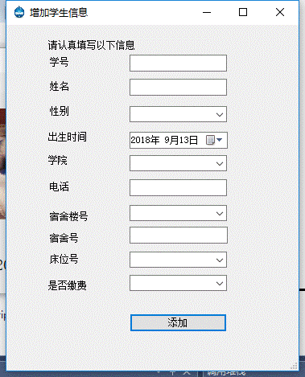
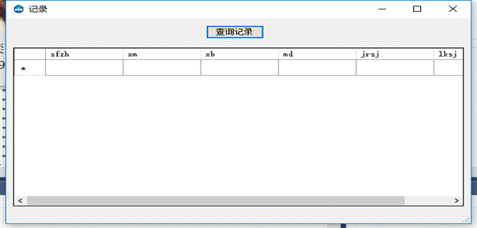

# 学生宿舍管理系统

# 一、环境

通过C#编写用户交互页面，并承担与数据库的交互，SqlServer负责数据的存储。

# 二、系统设计

## （一）系统功能分析

本系统是参照我们学校的实际情况而设计的一套针对性和功能都比较强的宿舍管理系统.本宿舍管理系统可实现学生基本信息、宿舍信息等的录入、修改、查询、更新和删除操作以及外来人员的登记查询更新等操作。

## （二）系统功能模块设计

1.系统操作

​    <1>修改密码

​    <2>关闭系统

2.连接操作

​    <1>测试数据库连接

​    <2>数据库登录

3.查询操作

​    <1>范围查询

​    <2>精确查询

4.宿舍管理操作

​    <1>增加学生信息

​    <2>删除学生信息

​    <3>更改学生信息

5.出入登记操作

<1>入登记

<2>出登记

<3>查看登记表

<4>登记表备份

6.帮助操作

​    <1>查看帮助文件

​    <2>关于

# 三、数据库设计

## （一）    需求分析

1.1需求详述

  (1) 新的一个学期开始之后，学校教工人员可以添加新的学生宿舍信息，比如宿舍楼、宿舍号等；如果中途有新转来或转走或退学的学生，也可以修改学生宿舍信息；学生毕业之后，学校教工人员可以删除该学生的所有信息。

  (2)系统能够对宿舍、学生、住宿信息进行登记和调整，并能够随时进行各种查询和统计等处理操作

  (3)系统运行在Windows平台上,要求有一个较好的图形用户界面,操作要求简单。

  (4)系统应该有很好的可扩展性,以便学校根据实际情况添加新的功能

1.2功能需求

  本学生宿舍管理系统需要完成的功能有用户管理、学生宿舍管理两个部分。

  (1)用户管理 该功能用于管理使用该系统的用户，以及模块按权限进行分配，从而为系统提供一定的安全性。使用这个系统的用户主要包括2种：一是系统管理员，拥有对用户和表的所有权限；一是教务人员，可以对学生住宿情况进行管理，主要是增、删、改和查询信息；系统管理员也可以修改其余用户密码。

  (2)学生宿舍管理 添加、修改、删除和查询学生宿舍信息：根据院系和年纪进行寝室分配，实现入住学生信息的登记、维护和查询功能，按学院名称、学生号等信息查询住宿信息，对学生或外来人员进出公寓的情况进行登记，实现基本的出入监控功能。

1.3数据需求

通过分析，总结出本系统对数据的需求如下：

(1)外来人员（身份证号，姓名，性别）

(2)宿舍楼（编号，楼层数，床位数，单价）

(3)学生（学号，姓名，性别，出生日，电话）

(4)学院（学院编号，学院名称）

(5)进入（目的,进入时间，离开时间）

(6)住宿（宿舍楼号码，宿舍号，床位号，是否缴费）

(7)属于（所在学院，所在班级）

## （二）    概念结构设计

2.1概念模型

概念结构设计就是从现实概念中抽象出概念模型,即对信息世界建模,所以概念模型应该能方便、准确的表示信息世界中的常用概念。概念模型的表示方法最著名的实体-联系方法，在该方法中实体型用矩形表示，矩形框内写明实体名；属性用椭圆表示，并用无向边将其与相应的实体连接起来；联系用菱形表示，菱形框内写明联系名，并用无向边分别与有关实体型连接起来，同时在无向边旁表上联系的类型(1:1,1:n或n:m)。

2.2 E-R图表示概念模型

（1）学生实体E-R图

（2）学院实体

（3）宿舍楼实体

（4）外来人员实体

（5）合并分E-R图

（6）E-R图向关系模型转换

在二元联系中，数据模型实体间的联系有一对一（1：1）、一对多（1：n）和多对多（m：n）三种。

两实体的联系为1：1，可将联系与任意一端对应的关系模式合并。具体做法是：将两个实体各用一个关系表示，然后将其中一个关系的关键字和联系的属性加入另一个关系的属性。一个关系的关键字存储在另一个关系中时，称为另一个关系的外键。

一个1：n联系可以与“1”端对应的关系模式合并。首先，一个实体用1个关系表示，然后将联系的属性和“n”端对应关系的键置于“1”端对应的关系中。

一个m：n转换为一个关系模式。多对多联系不能与任一端实体对应的关系模式合并，否则会引起插入异常和修改异常。联系本身的属性以及与该联系相连的实体的键都将转换为该关系的属性，关系的键是各实体键的组合。

根据以上转化原则，得到以下一组关系模式

学生（学号，姓名，性别，出生日期，学院号，班级号，电话，宿舍楼号，宿舍号，床位号，是否缴费）

外来人员（身份证号，姓名，性别，目的，进入时间，离开时间）

宿舍楼（编号，楼层数，床位数，单价）。

## （三）    逻辑结构设计

根据对需求分析得到的数据结构进行分析,按数据输入输出的要求,确定表和表间的关系，并验证、调整、修改、完善，使其能够实现用户对数据和功能的要求。本系统根据分析确定系统要设置如下：（数据库里存储中文列名的首个字母：如学号—xh）

  (1)学生基本表：（学号char(12)，姓名varchar(8)，性别char(2) check(xb in('男','女')))，出生日期date，学院号char(2)，班级号char(2)，电话char(11)，宿舍楼号char(2)，宿舍号char(3)，床位号char(1)（只能为1,2，3,4），是否缴费char(2) check(sfjf in('是','否'))）。学号为主键，为学院号建立索引，通过该索引和学院基本表建立关联。

  (2)宿舍楼基本表：（编号char(2)，楼层数char(2)，床位数char(4)，单价varchar(4)）。其中编号为主键。

  (3)学院基本表：（学院编号char(2)，学院名称varchar(30)）。其中学院编号为主键，为学院编号建立索引，通过学院编号和学生基本表建立关联。

  (4)外来人员基本表：（身份证号char(18)，姓名varchar(8)，性别char(2) check(xb in('男','女'))，目的varchar(40)，进入时间Datetime，离开时间Datetime）。其中身份证号为主键。

## （四）    物理结构设计

学生基本表

| 字段名 | 类型    | 宽度          | 是否必填 | 中文别名 |
| ------ | ------- | ------------- | -------- | -------- |
| Xh     | Char    | 12            | Yes      | 学号     |
| Xm     | varchar | Max=12        | No       | 姓名     |
| Xb     | Char    | 2（男or女）   | No       | 性别     |
| Csrq   | Date    |               | No       | 出生日期 |
| Xyh    | Char    | 2             | No       | 学员号   |
| Bjh    | Char    | 2             | No       | 班级号   |
| Dh     | Char    | 11            | No       | 电话     |
| Sslh   | Char    | 2             | No       | 宿舍楼号 |
| Ssh    | Char    | 3             | No       | 宿舍号   |
| Cwh    | Char    | 1(1or2or3or4) | No       | 床位号   |
| Sfjf   | Char    | 2(是or否)     | no       | 是否缴费 |

学院基本表

| 字段名 | 类型    | 宽度 | 是否必填 | 中文别名 |
| ------ | ------- | ---- | -------- | -------- |
| Xybh   | Char    | 2    | Yes      | 学院编号 |
| Xymc   | Varchar | 30   | No       | 学院名称 |

宿舍楼基本表

| 字段名 | 类型    | 宽度 | 是否必填 | 中文别名 |
| ------ | ------- | ---- | -------- | -------- |
| Bh     | Char    | 2    | Yes      | 编号     |
| Lcs    | Char    | 2    | No       | 楼层数   |
| Cws    | Char    | 4    | No       | 床位数   |
| Dj     | Varchar | 4    | No       | 单价     |

外来人员基本表

| 字段名 | 类型     | 宽度        | 是否必填 | 中文别名 |
| ------ | -------- | ----------- | -------- | -------- |
| Sfzh   | Char     | 18          | Yes      | 身份证号 |
| Xm     | Varchar  | 8           | No       | 姓名     |
| Xb     | Char     | 2（男or女） | No       | 性别     |
| Md     | Varchar  | 40          | No       | 目的     |
| Jrsj   | Datetime |             | No       | 进入时间 |
| Lksj   | Datetime |             | No‘’     | 离开时间 |

 

# 四、数据库实现

1.建立学生表

2.建立学院表

3.建立宿舍楼表

4.建立外来人员表

# 五、系统实现

（1）主界面

1.用于计时器启动

private void frm1_Load(object sender, EventArgs e)

​    {

​      timer1.Start();

​    }

2.计时器内容

private void timer1_Tick(object sender, EventArgs e)

​    {

​      lab5.Text = DateTime.Now.AddSeconds(0).ToString("yyyy年MM月dd日 dddd tt hh:mm:ss");

​    }

**（2）登录界面

1.登录按钮所用代码

private void btn1_Click(object sender, EventArgs e)

​    {

​      string x = txt1.Text;

​      string y = txt2.Text;

​      try

​      {

​        string constr = "server=localhost;database=huyuk;uid='" + x + "';pwd='" + y + "';";

​        SqlConnection conn = new SqlConnection(constr);

​        conn.Open();

​        MessageBox.Show("登录成功。可以进行进一步操作。", "登录结果");

​      }

​      catch

​      {

​        MessageBox.Show("登录失败，请检查用户名密码是否正确。", "登录结果");

​      }

​    }

（3）范围查询界面

1.范围查询所用代码

private void frm3_Load(object sender, EventArgs e)

​    {

​      SqlConnection conn = new SqlConnection();

​      conn.ConnectionString = "Data Source=localhost;Initial Catalog=huyuk; User ID=sa;Password=123";

​      conn.Open();

​      SqlCommand com = new SqlCommand();     

​      com.Connection = conn; 

​      com.CommandText = "select xymc from xy";

​      SqlDataReader dr;

​      dr = com.ExecuteReader();

​      cbx1.Items.Clear();

​      while (dr.Read())

​      { 

​        cbx1.Items.Add(dr[0].ToString());

​      }

​      dr.Close();

​      conn.Close();

 

​    }//用于填充学院下拉框

2.单击查询按钮所用代码

private void btn1_Click(object sender, EventArgs e)

​    {

​      conn.Open();

​      

​      try

​      {

​        string str = "select * from xs,xy where xs.xyh=xy.xybh ";

​        if (txt1.Text.Trim().Length > 0)

​        {

​          str += "and xm='" + txt1.Text + "'";

 

​        }

​        if (cbx1.Text.Trim().Length > 0)

​        {

​          

​            str += "and xymc='" + cbx1.Text + "'";

​          

​        }

​        SqlCommand comm = new SqlCommand(str, conn);

​        comm.ExecuteNonQuery();

​        SqlDataAdapter sd = new SqlDataAdapter(comm);

​        DataSet ds = new DataSet();

​        sd.Fill(ds);

​        lvw1.DataSource = ds.Tables[0];

​      }

​      catch (SqlException err)

​      {

​        label1.Text = "无法读取数据";

​      }

​      finally

​      {

​        conn.Close();

​       

​      }

 

​    }

（4）精确查询界面

1.单击查询按钮所用代码

private void btn1_Click(object sender, EventArgs e)

​    {

​      sconn.Open();

​      SqlDataAdapter sda = new SqlDataAdapter("select * from xs where xh='" + txt1.Text + "'", sconn);

​      DataSet clnnum = new DataSet();

​      sda.Fill(clnnum, "xs");

​      this.dataGridView1.DataSource = clnnum;

​      this.dataGridView1.DataMember = "xs";

​      sconn.Close();

​    }//查询出信息并填入下方gridview

（5）增加学生信息界面

1.载入时查询学院填入下拉框

private void frm5_Load(object sender, EventArgs e)

​    {

​      SqlConnection conn = new SqlConnection();

​      conn.ConnectionString = "Data Source=localhost;Initial Catalog=huyuk; User ID=sa;Password=123";

​      conn.Open();

​      SqlCommand com = new SqlCommand();

​      com.Connection = conn;

​      com.CommandText = "select xymc from xy";

​      SqlDataReader dr;

​      dr = com.ExecuteReader();

​      cbx1.Items.Clear();

​      while (dr.Read())

​      {

​        cbx1.Items.Add(dr[0].ToString());

​      }

​      dr.Close();

​      conn.Close();

​    }

2.单击查询按钮所用代码

private void btn1_Click(object sender, EventArgs e)

​    {

​      SqlConnection sqlconnect = new SqlConnection("Data Source=localhost;Initial Catalog=huyuk; User ID=sa;Password=123");

​      sqlconnect.Open();

​      string str = "";

​      SqlCommand cmd1 = new SqlCommand("select xybh from xy where xymc='" + cbx1.Text + "'", sqlconnect);

​      SqlDataReader dr;

​      dr = cmd1.ExecuteReader();

​      dr.Read();

​      string cno = dr[0].ToString();

​      dr.Close();

 

​      if (txt1.Text == "" || txt2.Text == "" || cbx6.Text == "" || cbx1.Items.Count == 0 || txt2.Text == "" || cbx2.Items.Count == 0 || cbx4.Items.Count == 0 || cbx4.Items.Count == 0)

​      {

​        MessageBox.Show("请输入该学生的完整信息");

​      }

​      else

​      {

​        str = "insert into xs (xh,xm,xb,csrq,xyh,dh,sslh,ssh,cwh,sfjf) values ('" + txt1.Text + "','" + txt2.Text + "','" + cbx6.Text + "','" + dtp1.Value.ToString("yyyy-MM-dd HH:mm:ss") + "','" + cno + "','" + txt3.Text + "','" + cbx2.Text + "','" + txt4.Text + "','" + cbx4.Text + "','" + cbx5.Text + "')";

 

​      }

​      SqlCommand sqlcommand = new SqlCommand(str, sqlconnect);

​      int s = sqlcommand.ExecuteNonQuery();

​      if (s == 1)

​      {

​        MessageBox.Show("添加成功");

​        txt1.Clear();

​      }

​      sqlconnect.Close();

 

​    }

（6）删除学生信息界面

1.查找按钮所用代码

private void btn1_Click(object sender, EventArgs e)

​    {

​      SqlConnection sconn = new SqlConnection("Data Source=localhost;Initial Catalog=huyuk; User ID=sa;Password=123");

​      sconn.Open();

​      

​      SqlDataAdapter sda = new SqlDataAdapter("select * from xs where xh='" + txt1.Text + "'", sconn);

​     

​      DataSet clnnum = new DataSet();

​      sda.Fill(clnnum, "xs"); 

​      this.dataGridView1.DataSource = clnnum;

​      this.dataGridView1.DataMember = "xs";

​      sconn.Close();

​    }

2.删除所用代码

private void btn2_Click(object sender, EventArgs e)

​    {

​      SqlConnection sqlconnect = new SqlConnection("Data Source=localhost;Initial Catalog=huyuk; User ID=sa;Password=123");

​      sqlconnect.Open();

​      string str = "";

​      if (txt1.Text.Trim().Length == 0)

​      {

​        MessageBox.Show("请输入要删除的学号！！！");

​      }

​      else if (txt1.Text.Trim().Length > 0 )

 

​      {

​        str = "delete from xs where xh=" + txt1.Text + "";

​      }          

​      SqlCommand sqlcommand = new SqlCommand(str, sqlconnect);

​      int s = sqlcommand.ExecuteNonQuery();

​      if (s == 1)

​      {

​        MessageBox.Show("删除成功");

​        txt1.Clear();    

​      }      

​      sqlconnect.Close();

​    }

（7）更改学生信息界面

1.填充下拉框所用代码

private void frm7_Load(object sender, EventArgs e)

​    {

​      SqlConnection conn = new SqlConnection();

​      conn.ConnectionString = "Data Source=localhost;Initial Catalog=huyuk; User ID=sa;Password=123";

​      conn.Open();

​      SqlCommand com = new SqlCommand();

​      com.Connection = conn;

​      com.CommandText = "select xymc from xy";

​      SqlDataReader dr;

​      dr = com.ExecuteReader();

​      cbx1.Items.Clear();

​      while (dr.Read())

​      {

​        cbx1.Items.Add(dr[0].ToString());

​      }

​      dr.Close();

​      conn.Close();

​    }

2.更改此人所用代码

private void btn1_Click(object sender, EventArgs e)

​    {

​      SqlConnection conn = new SqlConnection();

​      conn.ConnectionString = "Data Source=localhost;Initial Catalog=huyuk; User ID=sa;Password=123";

​      conn.Open();

​       SqlCommand comm = new SqlCommand("select * from xs where xh=" + txt1.Text,conn);

​      SqlDataReader dateReader = comm.ExecuteReader();

​      if (dateReader != null)

​      {

​        MessageBox.Show("查找成功！！");

​        dateReader.Read();

​        txt2.Text = dateReader[0].ToString(); // 把查到结果显示在文本框

​        txt3.Text = dateReader[1].ToString();

​        txt4.Text = dateReader[2].ToString();

​        txt5.Text = dateReader[3].ToString();

​        txt6.Text = dateReader[4].ToString();

​        txt7.Text = dateReader[5].ToString();

​        txt8.Text = dateReader[6].ToString();

​        txt9.Text = dateReader[7].ToString();

​        txt10.Text = dateReader[8].ToString();

​        txt11.Text = dateReader[9].ToString();

​      }

​      else

​      {

​        MessageBox.Show("请重新输入！！");

​      }

​    }

3.确定修改所用代码

private void btn2_Click(object sender, EventArgs e)

​    {

​      SqlConnection sqlconnect = new SqlConnection("Data Source=localhost;Initial Catalog=huyuk; User ID=sa;Password=123");

​      sqlconnect.Open();

​      SqlCommand cmd1 = new SqlCommand("select xybh from xy where xymc='" + cbx1.Text + "'", sqlconnect);

​      SqlDataReader dr;

​      dr = cmd1.ExecuteReader();

​      dr.Read();

​      string cno = dr[0].ToString();

​      dr.Close();

 

​      string str = "update xs set xh='" + txt12.Text + "',xm='" + txt13.Text + "',xb='" + cbx5.Text + "',csrq='" + dtp1.Value.ToString("yyyy-MM-dd HH:mm:ss") + "',xyh='" + cno + "',dh='" + txt14.Text + "',sslh='" + cbx2.Text + "',ssh='" + textBox1.Text + "',cwh='" + cbx4.Text + "',sfjf='" + cbx6.Text + "'where xh=" + txt1.Text;

​      SqlCommand sqlcommand = new SqlCommand(str, sqlconnect);

​      int s = sqlcommand.ExecuteNonQuery();

​      if (s == 1)

​      {

​        MessageBox.Show("修改成功");

​        txt1.Clear();

​      }

​      sqlconnect.Close();

​    }

（8）外来人员入登记界面

1.获取当前时间所用代码

private void btn2_Click(object sender, EventArgs e)

​    {

​      txt4.Text = DateTime.Now.ToString();

​    }

2.确认并登记所用代码

private void btn1_Click(object sender, EventArgs e)

​    {

​       SqlConnection sqlconnect = new SqlConnection("Data Source=localhost;Initial Catalog=huyuk; User ID=sa;Password=123");

​      sqlconnect.Open();

​      string str = "";

​      str = "insert into wlry(sfzh,xm,xb,md,jrsj) values(" + txt1.Text + ",'" + txt2.Text + "','" + cbx1.Text + "','" + txt3.Text + "','" + DateTime.Now.ToString("yyyy/MM/dd HH:mm:ss") + "')";

​      SqlCommand sqlcommand = new SqlCommand(str, sqlconnect);

​      int s = sqlcommand.ExecuteNonQuery();

​       if (s == 1)

​      {

​        MessageBox.Show("登记成功");

​        txt1.Clear();

​      }

​      sqlconnect.Close();

​    }

（9）外来人员出登记界面

1.查找所用

private void btn1_Click(object sender, EventArgs e)

​    {

​      SqlConnection sconn = new SqlConnection("Data Source=localhost;Initial Catalog=huyuk; User ID=sa;Password=123");

​      sconn.Open();

​      SqlDataAdapter sda = new SqlDataAdapter("select * from wlry where sfzh='" + textBox1.Text + "'", sconn);

​      DataSet clnnum = new DataSet();

​      sda.Fill(clnnum, "wlry");

​      this.dataGridView1.DataSource = clnnum;

​      this.dataGridView1.DataMember = "wlry";

​      sconn.Close();

​    }

2.获取当前时间

private void btn2_Click(object sender, EventArgs e)

​    {

​      textBox2.Text = DateTime.Now.ToString(); 

​    }

3.更新离开时间

private void btn3_Click(object sender, EventArgs e)

​    {

​      SqlConnection sqlconnect = new SqlConnection("Data Source=localhost;Initial Catalog=huyuk; User ID=sa;Password=123");

​      sqlconnect.Open();

​      string str = "";

​      str = "update wlry set lksj='" + DateTime.Now.ToString("yyyy/MM/dd HH:mm:ss") + "'where sfzh=" + textBox1.Text ;

​      SqlCommand sqlcommand = new SqlCommand(str, sqlconnect);

​      int s = sqlcommand.ExecuteNonQuery();

​      if (s == 1)

​      {

​        MessageBox.Show("离开时间登记成功");

​        textBox1.Clear();

​      }

​      sqlconnect.Close(); }

（10）查询全部登记记录界面

1.查询记录所用

private void button1_Click(object sender, EventArgs e)

​    {

​      SqlConnection sconn = new SqlConnection("Data Source=localhost;Initial Catalog=huyuk; User ID=sa;Password=123");

​      sconn.Open();

​      SqlDataAdapter sda = new SqlDataAdapter("select * from wlry " , sconn);

​      DataSet clnnum = new DataSet();

​      sda.Fill(clnnum, "wlry");

​      this.dataGridView1.DataSource = clnnum;

​      this.dataGridView1.DataMember = "wlry";

​      sconn.Close();

​    }

 

# 六、结束语

通过本次数据库课程设计，让我们接触到c#这种新的语言。从早期的学习到后期的设计中，我们收获了不少的经验，其次我体会到了团队合作的重要性，这次课设我们分工合作，一人负责数据库和程序的编写，一人负责内部空间的调整。我们两人缺少任意一方的努力都不能完成这次课程设计。同时在这种模式下，我们互相分享各自的想法，共同摸索代替前进，有时自己的一个bug怎么也找不出来，但和搭档一起看一起想则解决方法想的很快，比如一个数据库在不同电脑上数据库地址不同，一开始我只能想到让用户自己输入数据库地址，但在搭档的帮助下，我知道了可以通过localhost代替本机地址，达到每台电脑都适配的目的，减少了程序的复杂度，减轻了用户的使用负担。一个人所学的知识不可能面面俱到，只有通过合作，取长补短，才能将任务完成的更为出色。

通过此次课程设计，我们加深了对数据库知识的理解，在课程设计的准备阶段，我们复习了数据库的相关命令和机制，以及学习了C#的winforms编程，在这之外，还上网查询了一些相关资料，和一些实际问题解决的例子，通过理解别人的解决思路，将方法收入自己的脑海中。在这个过程中。我们对整个连接数据库程序的过程有了一个更加具体详细的认识，在编写过程中我们还学会了c#中与数据库进行连接，实现了相关的增删查改操作。

